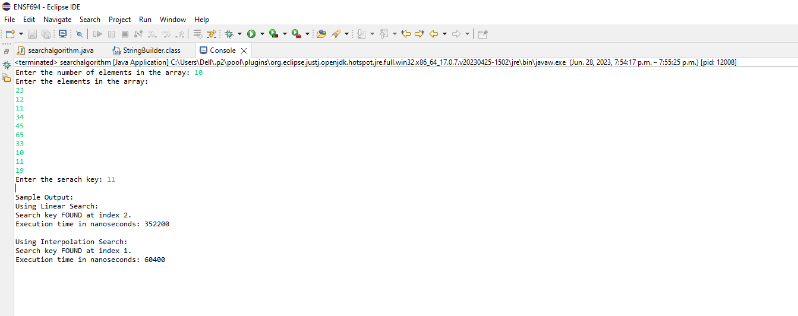
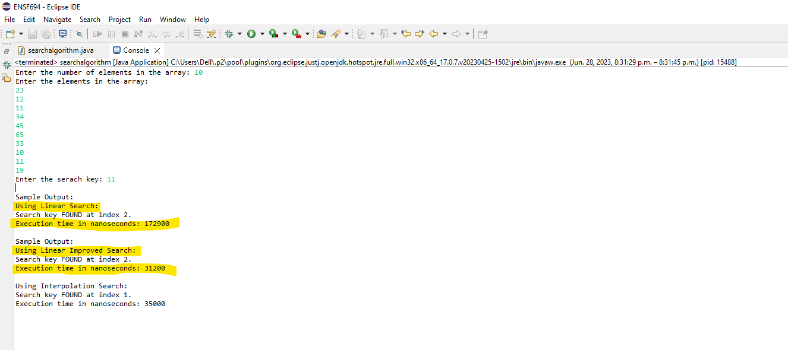

# Lab 2 ENSF 694 Usman Liaqat

## Q2

Using the sample input provided the run time of the interpolation algorithm was much better. It is faster because the interpolation 
algorithm makes an intelligent guess regarding where the target values most likely to exist in the array using the formulas provided. The interpolation algorithm also has faster 
convergence by making better successive approximatations of the target values location. Furthermore interpolation algorithm  assumes that the elements are uniformly distributed in the 
sorted array.  It makes estimates based on the values at the start and end of the array, which helps in quickly narrowing down the search for the 
target value. Linear search, on the other hand, does not take advantage of the sorted order and checks each element one by one, which is tedious and long process.

## Execution and Runtime Screenshot

## Q3

To improve the runtime, I start the serach using with the middle index and simultaneously searched for serach key in both forward and backward directions.
By starting the search from the middle index, we may have a higher chance of finding the target value earlier if it is located closer to the middle. This is 
because we are essentially dividing the array in half, reducing the number of elements to search through. Furthermore, we have reduced iterations as we are 
simultaneously checking forwards and backwards directions in each single iteration.

## Execution and Runtime Screenshot
